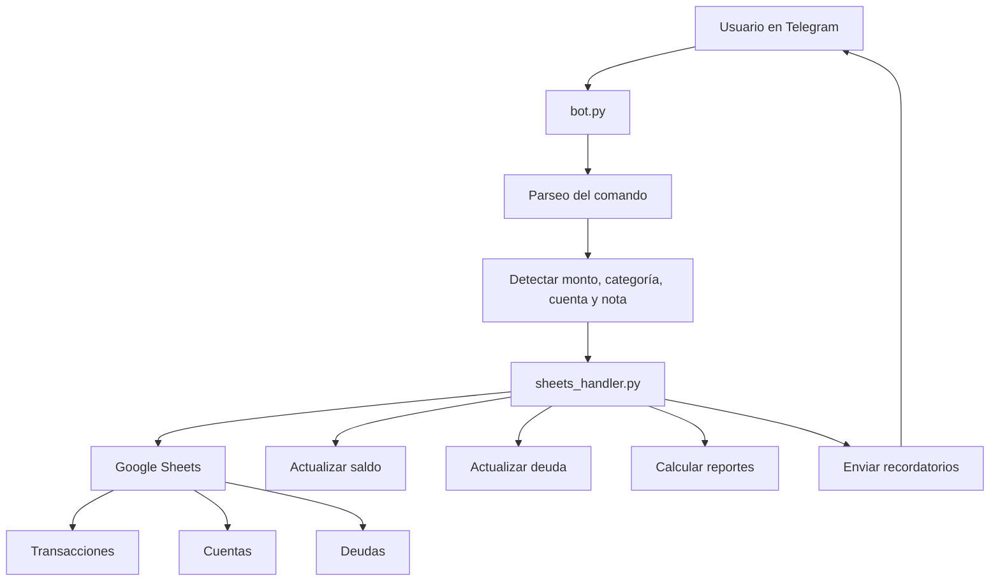
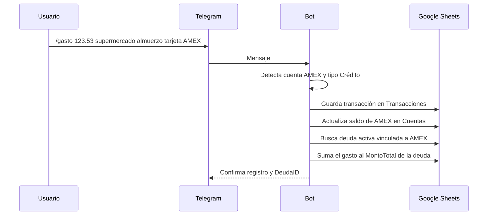
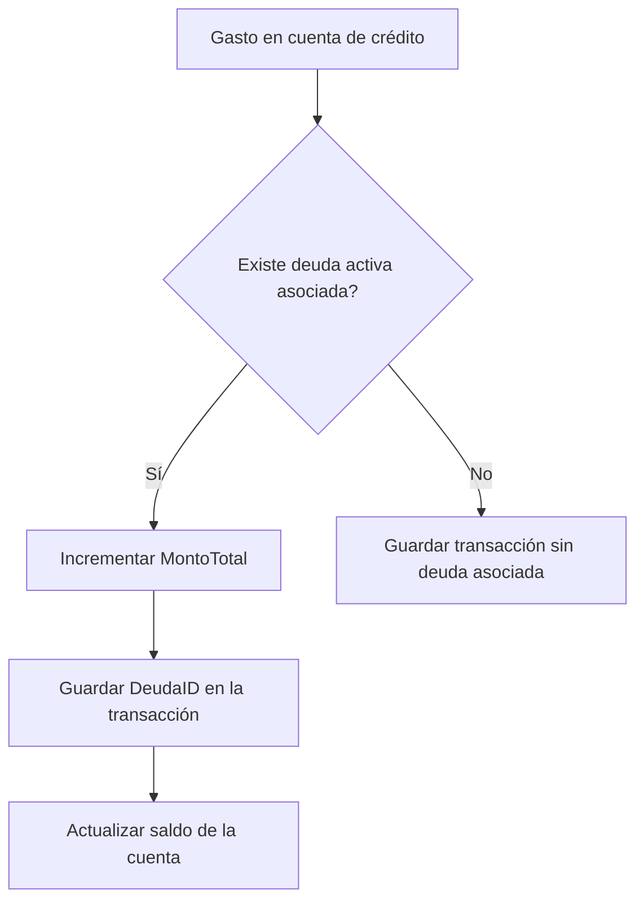

# Finanzas Bot

Bot de Telegram para registrar gastos e ingresos, sincronizar movimientos con Google Sheets, controlar deudas de tarjetas de crédito y recibir recordatorios automáticos de vencimiento.

## Resumen

Este proyecto permite llevar un control financiero personal desde Telegram, guardando cada transacción en una hoja de Google Sheets y actualizando automáticamente:

- saldos de cuentas
- deuda asociada a tarjetas de crédito
- historial de transacciones
- balances mensuales
- recordatorios de vencimiento de deudas

El flujo está pensado para que puedas escribir algo tan simple como:

```text
/gasto 123.53 supermercado almuerzo tarjeta AMEX
```

y el bot se encargue de:

- detectar la cuenta AMEX
- reconocer que es una cuenta de tipo Crédito
- asignar el DeudaID correcto
- sumar el gasto a la deuda activa
- actualizar el saldo de la cuenta

## Características principales

- Registro de gastos e ingresos desde Telegram.
- Detección automática de cuenta en el texto del mensaje.
- Soporte para cuentas de tipo `Efectivo`, `Banco`, `Crédito` y `Debito`.
- Actualización automática de saldos en Google Sheets.
- Asociación de gastos a deudas activas mediante `DeudaID`.
- Cálculo de deuda pendiente usando `MontoTotal`, `MontoPagado` y `FechaVencimiento`.
- Comandos para resumen, balance mensual, categorías y deudas activas.
- Edición y eliminación de transacciones ya registradas.
- Recordatorios automáticos de deudas próximas a vencer.
- Manejo correcto de montos con formato regional, como `1.314,13`.

## Arquitectura



## Flujo de trabajo



## Estructura del proyecto

```text
finanzas-bot/
├── .env
├── .gitignore
├── bot.py
├── config.py
├── credentials.json
├── README.md
├── requirements.txt
└── sheets_handler.py
```

## Archivos principales

### `bot.py`

Contiene la lógica del bot de Telegram:

- comandos disponibles
- parseo de mensajes
- validación de usuario autorizado
- envío de respuestas
- recordatorios automáticos con `JobQueue`

### `sheets_handler.py`

Contiene toda la lógica de negocio y acceso a Google Sheets:

- lectura y escritura de transacciones
- normalización de números y fechas
- búsqueda de cuentas
- actualización de saldos
- asociación de deudas
- edición y eliminación de transacciones
- generación de resúmenes y reportes
- consulta de recordatorios de deudas

### `config.py`

Carga variables de entorno y centraliza configuración:

- `TELEGRAM_TOKEN`
- `USER_ID`
- `SPREADSHEET_ID`
- `GOOGLE_CREDENTIALS_FILE`
- `BASE_CURRENCY`
- `EXCHANGE_RATE`

### `credentials.json`

Archivo JSON de la cuenta de servicio de Google.

**Importante:** no debe subirse a GitHub.

### `.env`

Archivo local con variables sensibles del entorno.

**Importante:** no debe subirse a GitHub.

### `requirements.txt`

Lista de dependencias Python necesarias para el proyecto.

## Instalación

### 1. Crear y activar el entorno virtual

```powershell
python -m venv .venv
.\.venv\Scripts\Activate.ps1
```

### 2. Instalar dependencias

```powershell
pip install -r requirements.txt
```

### 3. Configurar variables de entorno

Crear un archivo `.env` con algo similar a esto:

```env
TELEGRAM_TOKEN=tu_token_de_telegram
USER_ID=123456789
SPREADSHEET_ID=tu_id_de_google_sheets
EXCHANGE_RATE=3.44
```

### 4. Agregar credenciales de Google

Coloca el archivo `credentials.json` en la raíz del proyecto.

## Dependencias

Las principales librerías usadas son:

- `python-telegram-bot[job-queue]` para el bot y recordatorios programados.
- `gspread` para trabajar con Google Sheets.
- `google-auth` para autenticación con cuenta de servicio.
- `python-dotenv` para cargar variables del archivo `.env`.
- `pytz` y `APScheduler` como soporte de tareas programadas.
- `oauth2client` por compatibilidad con autenticación en Google APIs.

## Comandos del bot

### Registro de movimientos

#### `/gasto`

Registra un gasto y lo asocia automáticamente a la cuenta detectada.

Ejemplo:

```text
/gasto 123.53 supermercado almuerzo tarjeta AMEX
```

#### `/ingreso`

Registra un ingreso.

Ejemplo:

```text
/ingreso 1500 sueldo quincena BCP
```

### Consulta

#### `/resumen`

Muestra el saldo de cada cuenta, total de activos, total de pasivos y patrimonio neto.

#### `/mes [MM/AAAA]`

Muestra ingresos, gastos y ahorro de un mes específico.

Ejemplo:

```text
/mes 04/2026
```

#### `/categoria <nombre>`

Muestra el gasto acumulado de una categoría en el mes actual.

#### `/deudas`

Lista las deudas activas con su pendiente, vencimiento y cuenta asociada.

#### `/categorias`

Muestra categorías de gasto e ingreso, junto con sus subcategorías si existen.

### Mantenimiento de transacciones

#### `/editar <ID> <campo> <valor>`

Edita una transacción ya registrada.

Campos soportados:

- `monto`
- `moneda`
- `categoria`
- `subcategoria`
- `cuenta`
- `metodo`
- `nota`
- `fecha`

Ejemplo:

```text
/editar TX00012 monto 150.75
```

#### `/eliminar <ID>`

Elimina una transacción y revierte su impacto en saldo y deuda.

Ejemplo:

```text
/eliminar TX00012
```

## Cómo funciona el manejo de cuentas

El bot reconoce cuentas dentro del texto del mensaje y las cruza con la hoja `Cuentas`.

Tipos de cuenta soportados:

- `Efectivo`
- `Banco`
- `Crédito`
- `Debito`

La lógica de método de pago se asigna así:

- `Efectivo` → `Efectivo`
- `Banco` → `Transferencia`
- `Crédito` → `Tarjeta de Crédito`
- `Debito` → `Tarjeta de Débito`

## Cómo funciona el manejo de deudas

Cada cuenta de crédito puede estar vinculada a una deuda activa en la hoja `Deudas`.

El sistema usa:

- `CuentaAsociada` para enlazar la deuda con la cuenta
- `FechaVencimiento` para decidir si está vigente o vencida
- `Estado` para marcar `Activa`, `Vencida` o `Pagada`
- `MontoTotal` como el total consumido/acumulado en la deuda
- `MontoPagado` como lo ya abonado

### Lógica de deuda



## Recordatorios automáticos

El bot puede enviar recordatorios automáticos de deudas próximas a vencer.

Comportamiento actual:

- se ejecuta al iniciar el bot
- se ejecuta diariamente a las 09:00
- detecta deudas activas y vencidas próximas
- alerta por consola y por Telegram al usuario autorizado

Si el entorno no tiene `JobQueue`, el bot avisa que los recordatorios automáticos quedaron desactivados.

## Formato de números

El proyecto ya está preparado para manejar formatos regionales como:

- `1.314,13`
- `33.879,91`
- `25,50`
- `123.53`

Esto evita errores al leer montos y saldos desde Google Sheets, especialmente si la hoja está configurada con formato latinoamericano.

## Ejemplo de uso completo

1. Registras un gasto:

```text
/gasto 123.53 supermercado almuerzo tarjeta AMEX
```

2. El bot detecta:

- monto: `123.53`
- categoría: `supermercado`
- cuenta: `AMEX`
- método: `Tarjeta de Crédito`

3. Guarda en Google Sheets:

- fila en `Transacciones`
- saldo actualizado en `Cuentas`
- deuda incrementada en `Deudas`
- `DeudaID` asociado

## Recomendaciones

- Mantén `credentials.json` y `.env` fuera del repositorio.
- No edites manualmente montos formateados como texto en Google Sheets; deja que el bot los actualice.
- Si cambias la estructura de las hojas, revisa también `sheets_handler.py`.
- Si agregas nuevas cuentas, asegúrate de que el tipo sea uno de los soportados.

## Solución de problemas

### El bot no inicia recordatorios

Verifica que tengas instaladas las dependencias del scheduler:

```powershell
pip install "python-telegram-bot[job-queue]==22.7"
```

### Los montos salen mal

Revisa que la hoja esté usando formato numérico y que no hayas mezclado texto con números en columnas de saldo o deuda.

### No detecta una cuenta

Confirma que el nombre de la cuenta en la hoja `Cuentas` coincida con lo que escribes en el mensaje, ignorando tildes y mayúsculas.

## Licencia

Proyecto personal sin licencia pública definida.

