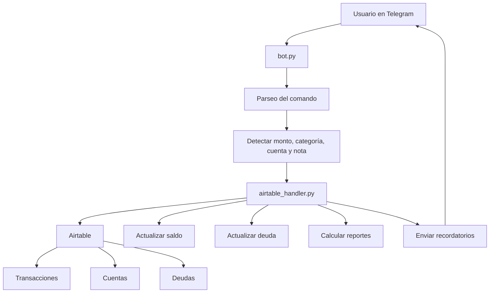
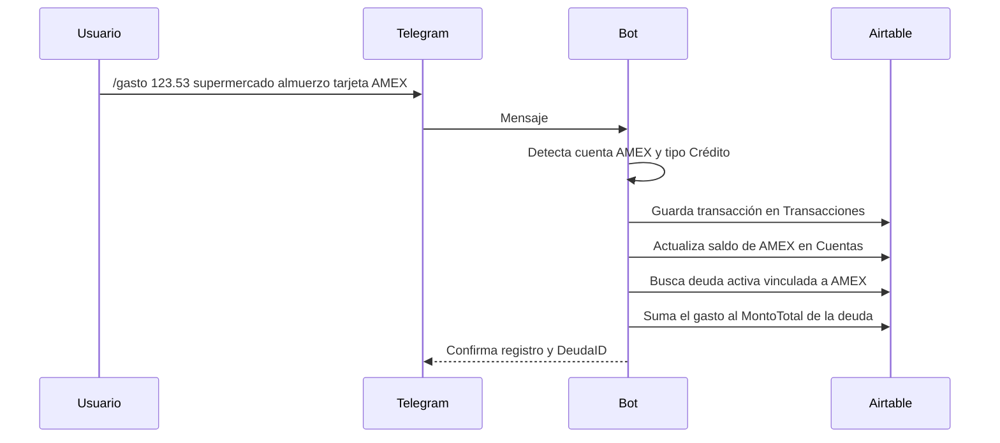
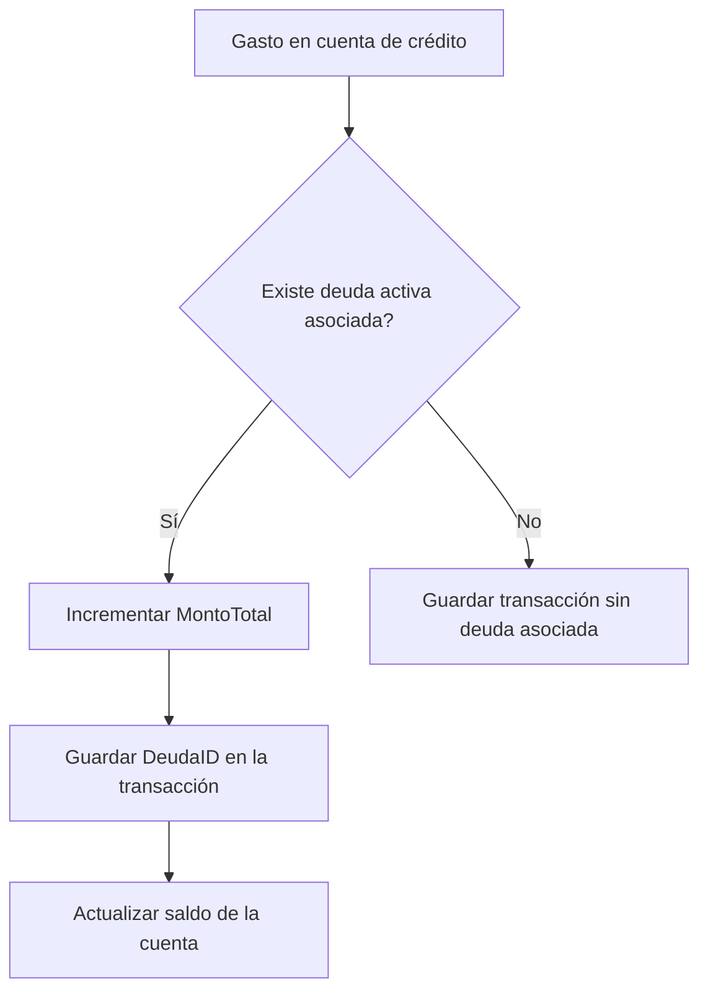

# Finanzas Bot

Bot de Telegram para registrar gastos e ingresos, sincronizar movimientos con Airtable, controlar deudas de tarjetas de crédito, recibir recordatorios automáticos de vencimiento y detectar correos bancarios con Gmail Push.

## Resumen

Este proyecto permite llevar un control financiero personal desde Telegram, guardando cada transacción en una base de Airtable y actualizando automáticamente:

- saldos de cuentas
- deuda asociada a tarjetas de crédito
- historial de transacciones
- balances mensuales
- recordatorios de vencimiento de deudas

El flujo está pensado para que puedas escribir algo tan simple como:

```text
/gasto 123.53 supermercado almuerzo tarjeta AMEX
```

y el bot se encargue de:

- detectar la cuenta AMEX
- reconocer que es una cuenta de tipo Crédito
- asignar el DeudaID correcto
- sumar el gasto a la deuda activa
- actualizar el saldo de la cuenta

## Características principales

- Registro de gastos e ingresos desde Telegram.
- Detección automática de cuenta en el texto del mensaje.
- Soporte para cuentas de tipo `Efectivo`, `Banco`, `Crédito` y `Debito`.
- Actualización automática de saldos en Airtable.
- Asociación de gastos a deudas activas mediante `DeudaID`.
- Cálculo de deuda pendiente usando `MontoTotal`, `MontoPagado` y `FechaVencimiento`.
- Comandos para resumen, balance mensual, categorías y deudas activas.
- Edición y eliminación de transacciones ya registradas.
- Registro de pagos de deuda desde cuentas de tipo Banco.
- Recordatorios automáticos de deudas próximas a vencer.
- Bandeja de movimientos pendientes para conciliación rápida.
- Conciliación por cuenta con sugerencias de transacciones faltantes.
- Gmail Push con Pub/Sub para detección casi instantánea de correos bancarios.
- Parser de correos para inferir tipo, monto, moneda y cuenta usando `NumeroCuenta`.
- Deduplicación por Message-ID/historial para evitar registros repetidos.
- Logs explícitos de descarte para Gmail Push, con prefijo `GMAIL_PUSH_DROP`.
- Estado de Gmail Push visible desde Telegram con `historyId`, `last_push_at` y modo de ejecución.
- Snapshot diario de saldos para auditoría (`SaldosHistoricos`).
- Exporte en PDF del cierre mensual con gráficos y KPIs.
- Manejo correcto de montos con formato regional, como `1.314,13`.
- Notas de voz con transcripción y confirmación antes de ejecutar.
- Interpretación de lenguaje natural para comandos generales: resumen, reporte, mes, deudas, categorías, pago, edición y eliminación.
- Keep-alive opcional para Render Free mediante cron-job.org.

## Migración única a Airtable

La aplicación usará Airtable como única fuente de datos. La migración no es un simple cambio de credenciales: implica redefinir el modelo de persistencia, adaptar la capa de acceso a datos y ajustar la importación histórica desde el XLSX exportado.

### Cambios que sufrirá la aplicación

- Airtable será la única base de datos operativa.
- `airtable_handler.py` actúa como capa de acceso a Airtable.
- La persistencia depende solo de Airtable.
- No queda ninguna dependencia de la integración anterior.
- Las operaciones usan `record ID` en lugar de números de fila.
- El modelo anterior se transformó en tablas con esquema fijo.
- La lógica de negocio vive en el código o en campos de Airtable.
- La importación histórica y la operación diaria comparten el mismo esquema para evitar duplicados.

### Lo que necesito para migrarlo completamente

1. El archivo histórico exportado en `.xlsx` o `.csv`.
2. El `Base ID` de Airtable (`app...`).
3. Un Personal Access Token de Airtable con acceso a esa base.
4. Confirmación de que la base destino será la fuente única.
5. Autorización para definir el esquema final de tablas y campos.
6. Un respaldo antes del corte final.

### Esquema final propuesto para Airtable

Tablas principales:

- `Transacciones`
- `Cuentas`
- `Categorias`
- `Deudas`
- `MovimientosPendientes`
- `GmailEstado`
- `SaldosHistoricos`

Relaciones y criterios:

- `Transacciones.Cuenta` referencia a `Cuentas.Nombre` o a un campo de vínculo equivalente.
- `Transacciones.DeudaID` referencia a `Deudas.ID`.
- `Deudas.CuentaAsociada` referencia a `Cuentas.Nombre`.
- `MovimientosPendientes.TXID` referencia a `Transacciones.ID` cuando se concilia.
- `GmailEstado` queda como tabla de estado clave/valor para `historyId`, `watch_expiration` y valores similares.
- `SaldosHistoricos` conserva snapshots diarios o manuales para auditoría.

### Pasos de migración recomendados

1. **Inventariar los datos actuales**
   - Revisar columnas, tipos, valores repetidos y dependencias entre tablas.

2. **Crear el esquema en Airtable**
   - Definir campos, selects, referencias y claves de deduplicación.

3. **Normalizar el XLSX histórico**
   - Limpiar fechas, montos, monedas, cuentas, categorías y deudas.
   - Ejecutar una importación única desde XLSX con un script temporal local (no versionado en el repo).

4. **Importar el histórico a Airtable**
   - Cargar en lotes y validar conteos, totales y duplicados.

5. **Refactorizar la capa de persistencia**
   - Reemplazar lecturas y escrituras por Airtable.
   - Cambiar búsquedas por filas por búsquedas por registro.
   - Mantener los cálculos en código cuando no existan equivalentes directos en Airtable.

6. **Actualizar configuración y dependencias**
   - Eliminar variables del modelo anterior.
   - Agregar `AIRTABLE_BASE_ID` y `AIRTABLE_API_KEY`.
   - Quitar dependencias ya no usadas.

7. **Validar en paralelo**
   - Comparar resultados del histórico importado con el comportamiento actual.

8. **Hacer el corte definitivo**
   - Desactivar toda referencia al sistema anterior.
   - Usar Airtable como única fuente desde ese momento.

### Riesgos y cambios operativos

- Airtable tiene límites de rate y paginación.
- No habrá edición manual en una hoja de cálculo para la lógica principal.
- Las conciliaciones y reportes leerán exclusivamente desde Airtable.
- Si había fórmulas de Airtable, ahora vivirán en el código o en campos derivados.

## Mejoras recientes

Las últimas mejoras ya integradas en la aplicación son:

- `/deudas` ahora muestra el ID de cada deuda activa.
- Los recordatorios automáticos también muestran el ID de la deuda.
- Se eliminó el comando `/recordatorios` para evitar duplicidad con `/deudas`.
- Se eliminó por completo `/recalcular` de la interfaz y del código.
- El flujo de deuda pasó a trabajar por ciclos: al pagarse una deuda recurrente se crea una nueva instancia para el siguiente vencimiento.
- `/conciliar` se restauró como comando de auditoría para comparar saldo real contra saldo en hoja y sugerir pendientes.
- Gmail Push ahora deja logs claros cuando descarta correos por remitente, tipo, monto, cuenta, duplicado o notificación vieja.
- `GMAIL_ALLOWED_SENDERS` se usa como filtro explícito y el estado del bot muestra si está en `polling` o `webhook`.
- El bot avisa cuando Gmail Push está habilitado pero corre en `polling`, porque en ese modo no existe el endpoint `/gmail/push`.

## Arquitectura



## Flujo de trabajo



## Estructura del proyecto

```text
finanzas-bot/
├── .env
├── .gitignore
├── airtable_backend.py
├── bot.py
├── config.py
├── gmail_push.py
├── README.md
├── requirements.txt
└── airtable_handler.py
```

## Archivos principales

### `bot.py`

Contiene la lógica del bot de Telegram:

- comandos disponibles
- parseo de mensajes
- validación de usuario autorizado
- envío de respuestas
- recordatorios automáticos con `JobQueue`

### `airtable_handler.py`

Contiene toda la lógica de negocio y acceso a Airtable:

- lectura y escritura de transacciones
- normalización de números y fechas
- búsqueda de cuentas
- actualización de saldos
- asociación de deudas
- edición y eliminación de transacciones
- generación de resúmenes y reportes
- consulta de recordatorios de deudas

### `gmail_push.py`

Contiene la integración de Gmail Push:

- autenticación OAuth de Gmail
- watch de Gmail API
- consumo de notificaciones Pub/Sub
- lectura del historial de Gmail
- parseo de mensajes RFC822
- registro de pendientes en Airtable

### `config.py`

Carga variables de entorno y centraliza configuración:

- `TELEGRAM_TOKEN`
- `USER_ID`
- `AIRTABLE_BASE_ID`
- `AIRTABLE_API_KEY`
- `BASE_CURRENCY`
- `EXCHANGE_RATE`
- `VOICE_LOCALE`
- `VOICE_LANGUAGE`
- `GROQ_API_KEY`
- `GROQ_TRANSCRIPTION_MODEL`
- `KEEPALIVE_ENABLED`
- `KEEPALIVE_INTERVAL_MINUTES`

### `.env`

Archivo local con variables sensibles del entorno.

**Importante:** no debe subirse a GitHub.

### `requirements.txt`

Lista de dependencias Python necesarias para el proyecto.


## Instalación

### 1. Crear y activar el entorno virtual

```powershell
python -m venv .venv
.\.venv\Scripts\Activate.ps1
```

### 2. Instalar dependencias

```powershell
pip install -r requirements.txt
```

### 3. Configurar variables de entorno

#### Opción recomendada (rápida)

1. Copia el archivo de ejemplo:

```powershell
Copy-Item .env.example .env
```

2. Abre `.env` y reemplaza los valores placeholder.

3. Define el modo de ejecución según tu entorno:

- Local: `BOT_MODE=polling`
- Render: `BOT_MODE=webhook` y configura `WEBHOOK_URL`

#### Opción manual

Crear un archivo `.env` con algo similar a esto:

```env
TELEGRAM_TOKEN=tu_token_de_telegram
USER_ID=123456789
AIRTABLE_BASE_ID=appXXXXXXXXXXXXXX
AIRTABLE_API_KEY=patXXXXXXXXXXXXXX
EXCHANGE_RATE=3.44
BASE_CURRENCY=PEN
```

### Acceso a Airtable

Este proyecto ya no usa la integración anterior.
Para operar, solo necesitas el `Base ID` y un token personal de Airtable con permisos sobre la base destino.

### Arquitectura multiusuario objetivo

La evolución multiusuario usará una sola base compartida preparada para varios usuarios. Todas las tablas financieras incluyen `TenantID` para separar los datos por espacio de usuario.

Tablas de identidad y control:

- `Tenants`
- `Usuarios`

Tablas financieras con `TenantID` obligatorio:

- `Transacciones`
- `Cuentas`
- `Categorias`
- `Deudas`
- `MovimientosPendientes`
- `GmailEstado`
- `SaldosHistoricos`

La configuración de usuarios nuevos debe hacerse desde Telegram, no editando Airtable manualmente. Los siguientes PRs agregarán comandos guiados para que el administrador autorice un usuario y luego configure cuentas, deudas y categorías sin salir del bot.

Gmail Push y voz quedan desactivados para usuarios nuevos hasta que exista soporte multi-tenant completo para esas funciones.

La capa `storage/airtable_store.py` centraliza el acceso multi-tenant a Airtable. Sus operaciones financieras requieren `tenant_id` y agregan/verifican `TenantID` para evitar lecturas o escrituras cruzadas entre usuarios.

Comandos admin iniciales:

- `/admin_add_user <telegram_id> <nombre>`: crea tenant y usuario activo con Gmail/Voz desactivados.
- `/admin_users`: lista usuarios registrados.
- `/admin_block_user <telegram_id>`: bloquea acceso.
- `/mi_config`: muestra el tenant y estado del usuario actual.

La lógica de setup por tenant vive en `tenant_setup_service.py`: precarga categorías, crea cuentas y crea deudas con `TenantID`. Los comandos guiados de configuración inicial deben apoyarse en ese servicio para evitar edición manual en Airtable.

## Dependencias

Las principales librerías usadas son:

- `python-telegram-bot[job-queue]` para el bot y recordatorios programados.
- `python-dotenv` para cargar variables del archivo `.env`.
- `pytz` y `APScheduler` como soporte de tareas programadas.
- `groq` para transcripción de notas de voz.
- `openpyxl` para leer el XLSX histórico durante la migración.

## Estado actual del proyecto

### Ya implementado

- ~~Registro de gastos e ingresos desde Telegram.~~
- ~~Detección automática de cuenta en el texto del mensaje.~~
- ~~Soporte para cuentas de tipo `Efectivo`, `Banco`, `Crédito` y `Debito`.~~
- ~~Actualización automática de saldos en Airtable.~~
- ~~Asociación de gastos a deudas activas mediante `DeudaID`.~~
- ~~Cálculo de deuda pendiente usando `MontoTotal`, `MontoPagado` y `FechaVencimiento`.~~
- ~~Comandos para resumen, balance mensual, categorías y deudas activas.~~
- ~~Edición y eliminación de transacciones ya registradas.~~
- ~~Registro de pagos de deuda desde cuentas de tipo Banco.~~
- ~~Recordatorios automáticos de deudas próximas a vencer.~~
- ~~Bandeja de movimientos pendientes y conciliación por cuenta.~~
- ~~Gmail Push con Pub/Sub, parser y deduplicación.~~
- ~~Snapshots de saldos para auditoría.~~
- ~~Exporte en PDF del cierre mensual con gráficos y KPIs.~~
- ~~Manejo correcto de montos con formato regional, como `1.314,13`.~~
- ~~Notas de voz con transcripción y confirmación antes de ejecutar.~~
- ~~Interpretación de lenguaje natural para comandos generales: resumen, reporte, mes, deudas, categorías, pago, edición y eliminación.~~
- ~~Keep-alive opcional para Render Free mediante cron-job.org.~~

### Pendientes recomendados

1. Persistir un historial de comandos de voz fallidos para afinar el parser sin guardar transcripciones completas.
2. Mejorar el soporte de conversación guiada para edición de transacciones complejas.
3. Incorporar gráficos históricos o comparativos por varios meses en el PDF.
4. Evaluar un panel web liviano de consulta rápida sin salir de Telegram.
5. Añadir alertas por errores operativos críticos o webhook.
6. Reforzar métricas operativas de Gmail Push para distinguir mejor descartes, duplicados y registros nuevos.

## Comandos del bot

### Registro de movimientos

#### `/gasto`

Registra un gasto y lo asocia automáticamente a la cuenta detectada.

Ejemplo:

```text
/gasto 123.53 supermercado almuerzo tarjeta AMEX
```

#### `/ingreso`

Registra un ingreso.

Ejemplo:

```text
/ingreso 1500 sueldo quincena BCP
```

### Consulta

#### `/resumen`

Muestra el saldo de cada cuenta, total de activos, total de pasivos y patrimonio neto.

#### `/mes [MM/AAAA]`

Muestra ingresos, gastos y ahorro de un mes específico.

Ejemplo:

```text
/mes 04/2026
```

#### `/reporte [MM/AAAA]`

Genera un PDF de cierre mensual con indicadores y visualizaciones.

Ejemplo:

```text
/reporte 04/2026
```

Si no envías fecha, usa el mes actual.

El reporte incluye:

- Ingreso total del mes
- Gasto total del mes
- Ahorro total del mes
- Total de transacciones
- Categoría con mayor gasto
- Transacción más alta
- Gráfico de barras (ingresos, gastos, ahorro)
- Gráfico circular de gastos por categoría
- Ranking gráfico de cuentas con mayor uso
- Fecha y hora de generación

#### `/categoria <nombre>`

Muestra el gasto acumulado de una categoría en el mes actual.

#### `/deudas`

Lista las deudas activas con su pendiente, vencimiento y cuenta asociada.

#### `/pendiente <tipo> <monto> <cuenta> <descripcion>`

Registra un movimiento detectado pero aún no confirmado en la bandeja de pendientes.

Ejemplo:

```text
/pendiente ingreso 1500 BCP transferencia cliente ABC
```

#### `/pendientes [N]`

Lista los pendientes más recientes para revisión rápida.

Ejemplo:

```text
/pendientes 10
```

#### `/confirmar_pendiente <ID> <categoria> [nota]`

Convierte un pendiente en transacción real y lo marca como confirmado.

Ejemplo:

```text
/confirmar_pendiente MP00001 Sueldo confirmado por correo
```

#### `/descartar_pendiente <ID> [motivo]`

Marca un pendiente como descartado sin registrar transacción.

Ejemplo:

```text
/descartar_pendiente MP00003 duplicado
```

#### `/conciliar <cuenta> <saldo_real> [moneda]`

Compara el saldo real de una cuenta contra el saldo en hoja y propone pendientes cercanos a la diferencia.

Ejemplo:

```text
/conciliar BCP 3580.40 PEN
```

#### `/gmail_watch`

Crea o renueva el watch de Gmail Push para que el buzón quede conectado al bot.

Ejemplo:

```text
/gmail_watch
```

#### `/gmail_estado`

Muestra el estado actual del watch y el último `historyId` persistido.

Ejemplo:

```text
/gmail_estado
```

#### `/snapshot`

Guarda un snapshot manual de saldos por cuenta en la hoja `SaldosHistoricos`.

Ejemplo:

```text
/snapshot
```

#### `/pagar <deuda_id> <monto> <cuenta_banco> [nota]`

Registra un pago de deuda usando una cuenta de tipo Banco.

Qué hace internamente:

- aumenta `MontoPagado` de la deuda
- reduce saldo de la cuenta banco
- crea una transacción tipo `Gasto` asociada al `DeudaID`
- recalcula estado de deuda (`Activa`, `Pagada`, `Vencida`)
- avanza `FechaVencimiento` un mes en cada pago registrado (aplica para tarjetas y servicios)

Ejemplo:

```text
/pagar 1 250 BCP pago quincena
```

#### `/categorias`

Muestra categorías de gasto e ingreso, junto con sus subcategorías si existen.

### Mantenimiento de transacciones

#### `/editar <ID> <campo> <valor>`

Edita una transacción ya registrada.

Campos soportados:

- `monto`
- `moneda`
- `categoria`
- `subcategoria`
- `cuenta`
- `metodo`
- `nota`
- `fecha`

Ejemplo:

```text
/editar TX00012 monto 150.75
```

#### `/eliminar <ID>`

Elimina una transacción y revierte su impacto en saldo y deuda.

Ejemplo:

```text
/eliminar TX00012
```

## Cómo funciona el manejo de cuentas

El bot reconoce cuentas dentro del texto del mensaje y las cruza con la hoja `Cuentas`.

Tipos de cuenta soportados:

- `Efectivo`
- `Banco`
- `Crédito`
- `Debito`

La lógica de método de pago se asigna así:

- `Efectivo` → `Efectivo`
- `Banco` → `Transferencia`
- `Crédito` → `Tarjeta de Crédito`
- `Debito` → `Tarjeta de Débito`

## Cómo funciona el manejo de deudas

Cada cuenta de crédito puede estar vinculada a una deuda activa en la hoja `Deudas`.

El sistema usa:

- `CuentaAsociada` para enlazar la deuda con la cuenta
- `FechaVencimiento` para decidir si está vigente o vencida
- `Estado` para marcar `Activa`, `Vencida` o `Pagada`
- `MontoTotal` como el total consumido/acumulado en la deuda
- `MontoPagado` como lo ya abonado

Para deudas recurrentes (por ejemplo servicios básicos), al registrar un pago se avanza `FechaVencimiento` en +1 mes automáticamente.

### Lógica de deuda



## Recordatorios automáticos

El bot puede enviar recordatorios automáticos de deudas próximas a vencer.

Comportamiento actual:

- se ejecuta al iniciar el bot
- se ejecuta diariamente a las 12:00 en tres ventanas: 7, 3 y 1 día antes del vencimiento
- detecta deudas activas y vencidas próximas
- alerta por consola y por Telegram al usuario autorizado

Si el entorno no tiene `JobQueue`, el bot avisa que los recordatorios automáticos quedaron desactivados.

## Render Free: limitaciones y mitigaciones

En plan gratuito de Render, el servicio puede entrar en reposo. Cuando eso ocurre:

- el primer mensaje después de inactividad puede demorar (cold start)
- Telegram reintenta el webhook, pero puede sentirse como "no responde"
- tareas programadas de recordatorio pueden no ejecutarse de forma confiable 24/7

Mitigaciones prácticas en free plan:

1. Priorizar comandos manuales para validar estado:
- `/deudas`
- `/resumen`
- `/snapshot`
- `/conciliar`

2. Usar recordatorio manual como respaldo operativo:
- Revisar deudas al menos una vez al día con `/deudas`.

3. Mantener tiempos de espera realistas:
- tras inactividad, el primer request puede tardar en despertar el servicio.

4. Evitar depender de eventos críticos solo en scheduler gratuito:
- tratar alertas automáticas como ayuda, no como única fuente.

5. Mantener el servicio despierto con una tarea externa opcional:
- configura `KEEPALIVE_ENABLED=true`
- define `WEBHOOK_URL=https://tu-app.onrender.com`
- crea un cron-job en cron-job.org para hacer una petición HTTP GET a esa URL cada 10 minutos
- cuando migres a un plan de pago, cambia `KEEPALIVE_ENABLED=false` y elimina el cron-job

Además del cron externo, el bot ejecuta un ping interno periódico a `WEBHOOK_URL/healthz` cuando está en `BOT_MODE=webhook`.
Verás trazas como `Keep-alive ping | url=... status=...` en logs.

### Keep-alive opcional con cron-job.org

Si usas Render Free y quieres evitar que el servicio se duerma, puedes automatizar una petición HTTP a la URL raíz del bot.

Configuración recomendada:

1. En tu `.env` o variables del entorno, define:

```env
KEEPALIVE_ENABLED=true
WEBHOOK_URL=https://tu-app.onrender.com
KEEPALIVE_INTERVAL_MINUTES=10
```

2. En cron-job.org, crea un nuevo cron job.
3. Usa método `GET`.
4. Apunta la URL a `WEBHOOK_URL/healthz` (por ejemplo, `https://tu-app.onrender.com/healthz`).
5. Programa la ejecución cada 10 minutos.
6. Si más adelante migras a un plan pago, desactiva la variable:

```env
KEEPALIVE_ENABLED=false
```

7. Elimina o pausa el cron job para no dejar tráfico innecesario.

Diagnóstico rápido en Render:

1. Verifica que aparezca `Keep-alive activo | cada ... min | url=...` al iniciar.
2. Verifica pings periódicos `Keep-alive ping | url=... status=...`.
3. Si no aparece, revisa que `BOT_MODE=webhook`, `KEEPALIVE_ENABLED=true` y `WEBHOOK_URL` estén definidos.

## Fase 1 de automatización (implementada)

Objetivo: reducir descuadres por movimientos no registrados (por ejemplo transferencias recibidas y no ingresadas en el momento).

Componentes implementados:

1. Hoja `MovimientosPendientes` (autocreada si no existe).
2. Registro manual rápido de pendientes desde Telegram (`/pendiente`).
3. Flujo de revisión (`/pendientes`, `/confirmar_pendiente`, `/descartar_pendiente`).
4. Conciliación por cuenta con sugerencias (`/conciliar`).

Estructura de `MovimientosPendientes`:

- `ID`
- `FechaDetectada`
- `Fuente`
- `Cuenta`
- `Tipo`
- `Monto`
- `Moneda`
- `Descripcion`
- `Referencia`
- `Estado` (`Pendiente`, `Confirmado`, `Descartado`)
- `Confianza`
- `TXID`
- `FechaResolucion`
- `Observacion`

## Fase 2 de automatización (implementada)

Objetivo: detectar movimientos desde correo bancario usando Gmail Push + Pub/Sub y llevarlos a una bandeja de revisión con deduplicación.

Componentes implementados:

1. Watch de Gmail API para tu buzón.
2. Publicación de eventos vía Pub/Sub hacia el endpoint `/gmail/push`.
3. Parser de asunto/cuerpo/adjuntos RFC822 para inferir `tipo`, `monto`, `moneda` y `cuenta`.
4. Match de cuenta usando la columna `NumeroCuenta` de la hoja `Cuentas`.
5. Registro automático en `MovimientosPendientes` usando `Fuente=GmailPush`.
6. Deduplicación por `Referencia` y por similitud (cuenta/tipo/monto).
7. Comando manual `/gmail_watch` y comando `/gmail_estado`.

Variables principales de entorno:

- `GMAIL_PUSH_ENABLED`
- `GMAIL_CLIENT_ID`
- `GMAIL_CLIENT_SECRET`
- `GMAIL_REFRESH_TOKEN`
- `GMAIL_USER_EMAIL`
- `GMAIL_PUSH_TOPIC_NAME`
- `GMAIL_PUSH_VERIFY_TOKEN`
- `GMAIL_WATCH_LABEL_IDS`
- `GMAIL_WATCH_RENEW_BUFFER_HOURS`
- `GMAIL_ALLOWED_SENDERS` (lista separada por comas)

Matching de cuenta por correo:

- En la hoja `Cuentas`, usa únicamente la columna `NumeroCuenta`.
- Guarda el número completo de la tarjeta o cuenta, por ejemplo `19171439582091`.
- Si el correo trae solo `*** 2091`, el bot hace match por últimos 4 dígitos.
- Si el correo menciona una cuenta que no está en `Cuentas`, se omite.

### Configuración de Gmail Push en Google Cloud

Este proyecto usa el mismo proyecto de Google Cloud ya configurado para el bot, pero Gmail Push requiere además credenciales OAuth de Gmail y Pub/Sub.

1. Entra a Google Cloud Console y selecciona el mismo proyecto del bot.
2. Habilita estas APIs:
	- Gmail API
	- Cloud Pub/Sub API
3. Crea la pantalla de consentimiento OAuth si todavía no existe.
4. Crea un OAuth Client ID para aplicación de escritorio o web.
5. Obtén un refresh token para el buzón que quieres monitorear y guárdalo en `GMAIL_REFRESH_TOKEN`.
6. Crea un topic de Pub/Sub, por ejemplo `gmail-notifications`.
7. Da permiso de `Publisher` al servicio `gmail-api-push@system.gserviceaccount.com` sobre ese topic.
8. Crea una suscripción push que apunte a `https://tu-servicio.onrender.com/gmail/push?token=TU_TOKEN_SECRETO`.
9. Carga en `.env` los valores de `GMAIL_CLIENT_ID`, `GMAIL_CLIENT_SECRET`, `GMAIL_REFRESH_TOKEN`, `GMAIL_PUSH_TOPIC_NAME` y `GMAIL_PUSH_VERIFY_TOKEN`.
10. Ejecuta `/gmail_watch` una sola vez para registrar el watch inicial.

### Cómo crear la suscripción push paso a paso

1. En Google Cloud Console ve a Pub/Sub > Topics y abre tu topic `gmail-notifications`.
2. Haz clic en Create subscription.
3. Asigna un nombre, por ejemplo `gmail-notifications-push`.
4. En Delivery type elige Push.
5. En Push endpoint coloca la URL pública de tu bot con el endpoint Gmail Push, por ejemplo:

```text
https://tu-servicio.onrender.com/gmail/push?token=TU_TOKEN_SECRETO
```

6. En Authentication deja el envío sin auth adicional si estás usando el token de verificación por query string.
7. Crea la suscripción.
8. Confirma que el topic tenga permiso de publicación para `gmail-api-push@system.gserviceaccount.com`.
9. Verifica que el bot exponga el endpoint `/gmail/push` en tu servidor público.
10. Ejecuta `/gmail_watch` para que Gmail registre el watch y empiece a emitir eventos.

### Qué hace cada pieza

- Gmail API detecta el correo nuevo.
- Pub/Sub entrega la notificación al endpoint `/gmail/push`.
- El bot usa `historyId` para consultar el mensaje real en Gmail.
- El parser lee remitente, asunto y cuerpo.
- Si el remitente coincide con `GMAIL_ALLOWED_SENDERS` y la cuenta aparece en `NumeroCuenta`, se registra el movimiento en `MovimientosPendientes`.
- Si el mismo mensaje vuelve a llegar, la deduplicación evita el doble registro.

### Siguiente paso después de obtener `GMAIL_REFRESH_TOKEN`

1. Pega el refresh token en tu archivo `.env`.
2. Verifica que `GMAIL_PUSH_ENABLED=true`.
3. Verifica que `GMAIL_USER_EMAIL` sea el buzón que vas a monitorear.
4. Verifica que `GMAIL_ALLOWED_SENDERS` contenga el remitente bancario permitido, por ejemplo `notificaciones@notificacionesbcp.com.pe`.
5. Verifica que `NumeroCuenta` en la hoja `Cuentas` tenga el número completo de la cuenta o tarjeta que quieres administrar.
6. Inicia el bot.
7. Ejecuta `/gmail_watch` para registrar o renovar el watch.
8. Revisa `/gmail_estado` para confirmar que quedó guardado el `historyId`.

### Estado actual del proyecto

1. Fase 1 lista: bandeja de pendientes y conciliación manual por Telegram.
2. Fase 2 lista: Gmail Push + Pub/Sub + parser + deduplicación.
3. Fase 3 lista: snapshots históricos y auditoría operativa.
4. El flujo IMAP fue eliminado; ya no existe el comando `/correo_scan`.

Si el watch falla, revisa en Google Cloud:

1. Que tu usuario esté agregado como tester en la pantalla OAuth.
2. Que Gmail API y Cloud Pub/Sub estén habilitadas.
3. Que el topic de Pub/Sub exista y el servicio `gmail-api-push@system.gserviceaccount.com` tenga permiso de Publisher.
4. Que la suscripción push apunte al endpoint `/gmail/push` con el token secreto correcto.

Cómo fluye el sistema:

1. Gmail detecta un correo nuevo.
2. Gmail publica un evento en Pub/Sub.
3. Pub/Sub hace POST al endpoint `/gmail/push`.
4. El bot consulta el historial Gmail desde el último `historyId` guardado.
5. El parser identifica el movimiento, hace match con `NumeroCuenta` y lo registra como pendiente.
6. Si el mensaje llega otra vez, la deduplicación evita el doble registro.

### Reglas de operación para BCP

1. El correo permitido puede ser solo `notificaciones@notificacionesbcp.com.pe`.
2. En `Cuentas`, la columna `NumeroCuenta` debe contener el número completo de la cuenta BCP, por ejemplo `123456789`.
3. Si el correo muestra solo `*** 2091`, el bot hará match por los últimos 4 dígitos.
4. Si el correo llega de otra cuenta o un número no registrado en `Cuentas`, se ignora.

## Roadmap recomendado

### Fase actual (Render Free)

1. ~~Consolidar confiabilidad básica de comandos (`/gasto`, `/ingreso`, `/pagar`, `/deudas`).~~
2. ~~Fase 2: Gmail Push + parser + deduplicación.~~
3. ~~Añadir snapshots diarios en Airtable (hoja histórica simple) para auditoría.~~
4. ~~Añadir modo opcional de keep-alive con variable de entorno para Render Free.~~
5. ~~Ajustar el parser de voz con frases reales del usuario para reducir ambigüedad.~~

### Fase siguiente (cuando migres a plan pago)

1. ~~Servicio always-on sin reposo para webhook estable.~~
2. ~~Recordatorios automáticos realmente confiables por cron interno.~~
3. ~~Múltiples horarios de notificación (ejemplo: 7 días, 3 días y 1 día antes del vencimiento).~~
4. Endpoint de healthcheck y monitoreo externo.
5. Añadir alertas por error operativo (credenciales, webhook).
6. Futuro panel web básico (resumen, deudas, bitácora) sin dejar Telegram.
7. Desactivar keep-alive externo cuando ya no sea necesario.

### Ideas futuras de producto

1. Soporte multimoneda más robusto con tipo de cambio automático por API.
2. Usar notas de voz que se transcriban a texto y que se interpreten a comandos.
3. Respuestas proactivas con resúmenes semanales y mensuales por Telegram.
4. Exportación de reportes comparativos entre varios meses.
5. Panel web de solo lectura para consultar estados desde el móvil.

## Formato de números

El proyecto ya está preparado para manejar formatos regionales como:

- `1.314,13`
- `33.879,91`
- `25,50`
- `123.53`

Esto evita errores al leer montos y saldos desde Airtable, especialmente si la hoja está configurada con formato latinoamericano.

También aplica a comandos de Fase 1 y Fase 2 (`/pendiente`, `/pendientes`, `/conciliar`, `/gmail_watch`, `/gmail_estado`, `/snapshot`), unificando el parseo para entradas como `314,13` y `314.13`.

## Ejemplo de uso completo

1. Registras un gasto:

```text
/gasto 123.53 supermercado almuerzo tarjeta AMEX
```

2. El bot detecta:

- monto: `123.53`
- categoría: `supermercado`
- cuenta: `AMEX`
- método: `Tarjeta de Crédito`

3. Guarda en Airtable:

- fila en `Transacciones`
- saldo actualizado en `Cuentas`
- deuda incrementada en `Deudas`
- `DeudaID` asociado

## Recomendaciones

- Mantén el `.env` fuera del repositorio.
- No edites manualmente montos formateados como texto en Airtable; deja que el bot los actualice.
- Si cambias la estructura de Airtable, revisa también `airtable_handler.py` y `airtable_backend.py`.


## Solución de problemas

### El bot no inicia recordatorios

Verifica que tengas instaladas las dependencias del scheduler:

```powershell
pip install "python-telegram-bot[job-queue]==22.7"
```

### Los montos salen mal

Revisa que la hoja esté usando formato numérico y que no hayas mezclado texto con números en columnas de saldo o deuda.

### No detecta una cuenta

Confirma que el nombre de la cuenta en la hoja `Cuentas` coincida con lo que escribes en el mensaje, ignorando tildes y mayúsculas.

## Licencia

Proyecto personal sin licencia pública definida.

