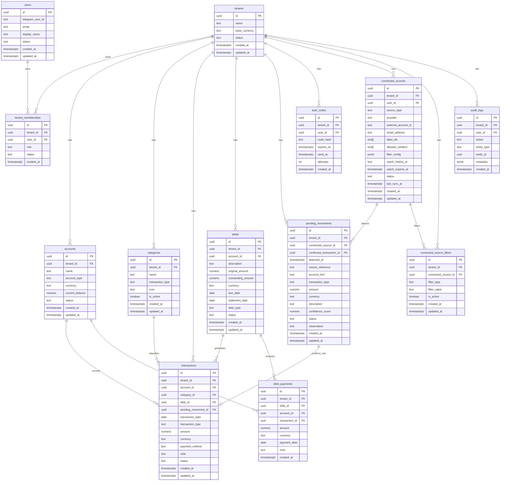

# Fint Database Architecture

This document defines the target relational model for the future Supabase/Postgres migration. The current Airtable storage remains operational, but new repository boundaries and future migrations must use this model as the reference.

## Naming Rules

- Table names use English, plural, snake_case: `transactions`, `pending_movements`.
- Column names use English, snake_case: `tenant_id`, `created_at`, `due_date`.
- Enum/default values use English lowercase snake_case: `active`, `expense`, `credit_card`.
- API responses can keep Spanish fields temporarily for mobile compatibility, but repositories and database models should map to normalized English internally.
- Every financial table must include `tenant_id` and must be scoped by tenant in repositories.
- Money values should use `numeric(14,2)` or stricter decimal types, never float.
- Timestamps should be `timestamptz`; date-only business fields should be `date`.
- Prefer soft state transitions over physical deletion for user-owned finance records.

## Entity Relationship Diagram



## Core Enums

- `tenant.status`: `active`, `suspended`, `deleted`
- `user.status`: `active`, `disabled`, `pending`
- `tenant_membership.role`: `owner`, `admin`, `member`, `viewer`
- `account.account_type`: `cash`, `bank_account`, `credit_card`, `loan`, `investment`, `other`
- `category.transaction_type`: `income`, `expense`
- `transaction.transaction_type`: `income`, `expense`, `transfer`, `debt_payment`, `adjustment`
- `transaction.status`: `posted`, `voided`, `pending_review`
- `debt.debt_type`: `credit_card`, `loan`, `service`, `installment`, `other`
- `debt.status`: `active`, `paid`, `overdue`, `cancelled`
- `pending_movement.status`: `pending`, `confirmed`, `discarded`
- `connected_source.source_type`: `gmail`, `outlook`, `telegram`, `manual`, `bank_integration`
- `connected_source.status`: `active`, `paused`, `error`, `revoked`
- `connected_source_filter.filter_type`: `sender_email`, `subject_contains`, `body_contains`, `account_hint`, `currency_hint`

## Gmail Source Model

Users can connect Gmail sources per tenant. Gmail watches and filters should be stored in `connected_sources` and `connected_source_filters`:

- `connected_sources.email_address`: Gmail account connected by the user.
- `connected_sources.label_ids`: Gmail labels watched, defaulting to `INBOX`.
- `connected_sources.allowed_senders`: fast allow-list for common sender filters.
- `connected_sources.filter_config`: provider-specific settings such as parsing rules, default account hints, or confidence thresholds.
- `connected_sources.watch_history_id`: latest Gmail history ID for push renewal.
- `connected_sources.watch_expires_at`: Gmail watch expiration to renew before expiry.
- `connected_source_filters`: normalized user-configurable filters for sender, subject, body, account hints, and currency hints.

Historical balance snapshots are intentionally excluded from the Supabase model.

## Migration Notes From Airtable

- Airtable `TenantID` maps to `tenants.id` or a temporary `legacy_tenant_id` during migration.
- Airtable Spanish values such as `Gasto`, `Ingreso`, `Activo`, `Efectivo` must be mapped to English enum values at repository/migration boundaries.
- Historical categories must not be physically deleted. Used categories should be marked with `is_active = false` when hidden from selectors.
- Existing API payloads can remain Spanish during the mobile transition, but the repository should return normalized internal records once Postgres is introduced.
- Balance-changing actions must write `audit_logs` when Postgres becomes the primary store.

## Repository Boundary

Application services should depend on repository interfaces, not on Airtable or Supabase directly.

```text
api handlers
  -> services: validation, business rules, API payload mapping
  -> repositories: persistence abstraction
  -> storage adapters: Airtable now, Postgres later
```

The current Python phase introduces the boundary incrementally. The future TypeScript backend should keep the same separation with typed schemas and database migrations.

## Phase 6 Implementation Status

- `repositories/` contains the persistence boundary and the current Airtable adapter.
- `domain/finance_models.py` contains normalized internal records with English field names and enum values.
- `utils/finance_format.py` contains reusable parsing/normalization helpers independent from Airtable.
- Mobile API payloads remain backward-compatible while services map internal normalized records to current response shapes.
- Direct repository tests cover idempotent category creation and adapter delegation.

## Phase 7 Migration Workflow

1. Create a Supabase/Postgres database.
2. Set `SUPABASE_DATABASE_URL` locally; do not change Render yet.
3. Run `python scripts/run_postgres_migrations.py`.
4. Run `python scripts/migrate_airtable_to_postgres.py --tenant-id <TENANT_ID>` for dry-run counts.
5. Run `python scripts/migrate_airtable_to_postgres.py --tenant-id <TENANT_ID> --apply` only after reviewing counts.
6. Run `python scripts/validate_postgres_migration.py --tenant-id <TENANT_ID>` until all totals match.
7. Test API locally with `FINANCE_REPOSITORY_BACKEND=postgres`.
8. Switch production only after tenant validation, API smoke tests, and rollback plan are complete.

Current state: the schema, migration runner, validation report, and parallel `PostgresFinanceRepository` exist. Airtable remains the default active backend.
